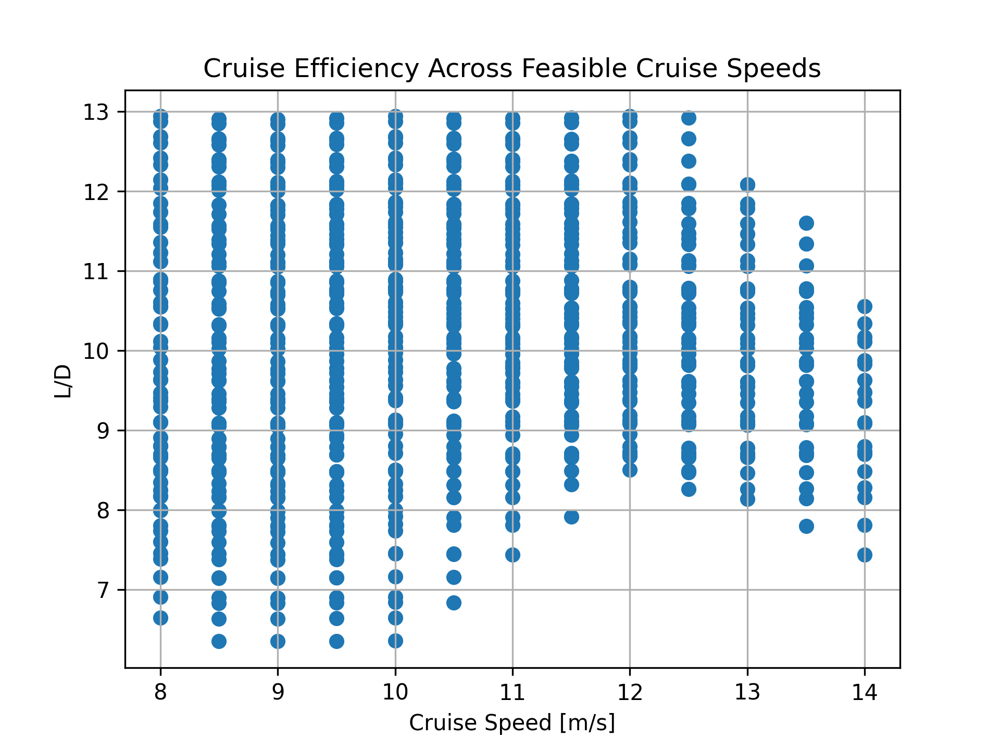
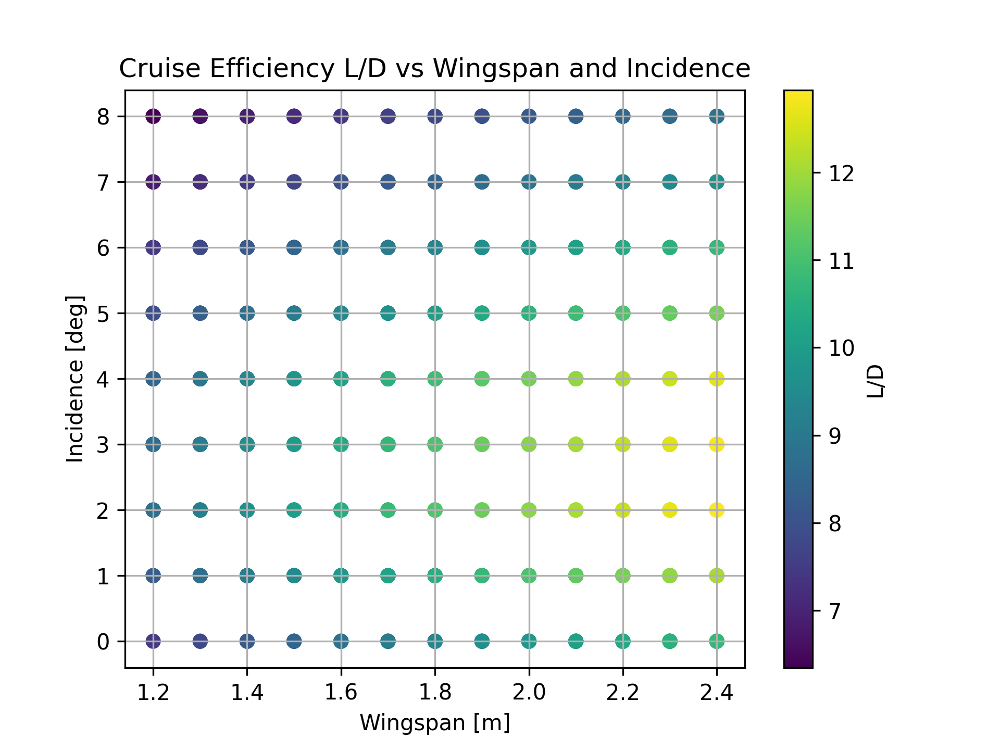
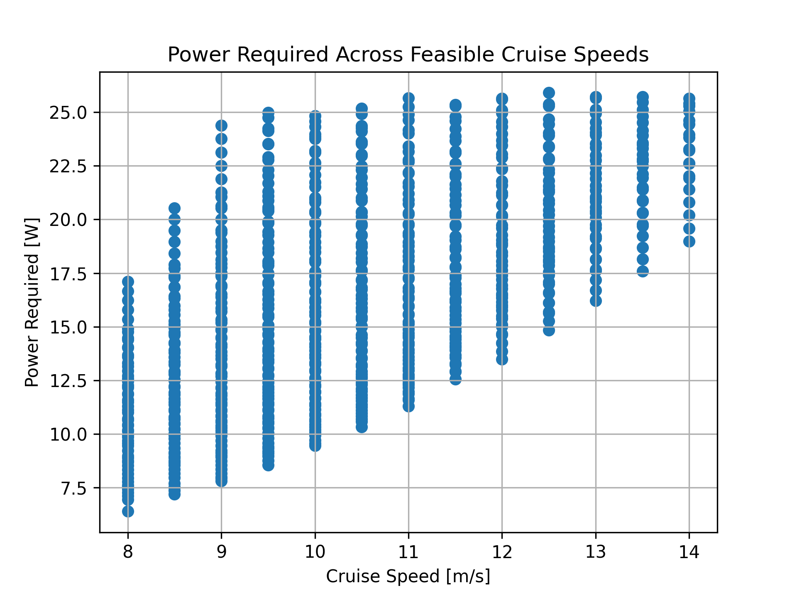
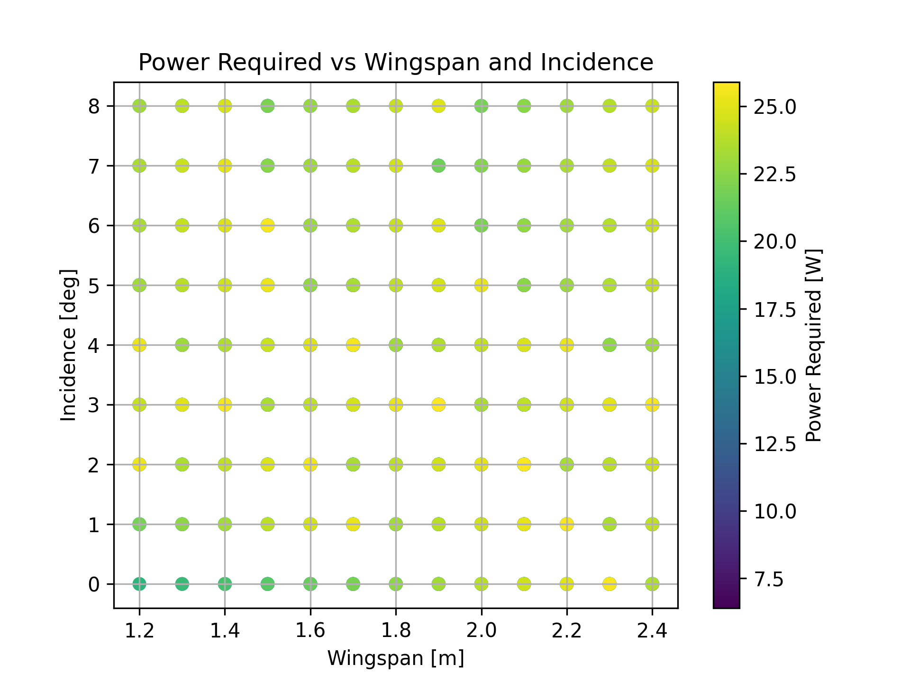

# RPV Wing Optimisation

A Python project that tests different wing designs for a small surveillance drone (RPV).

## What this project does

This program tests many combinations of:

- cruise speed
- wingspan
- wing incidence angle

For every combination, it calculates whether the aircraft could fly steadily. It checks:

- whether the wing produces enough lift to support the aircraft weight
- whether the propeller produces enough thrust to overcome drag
- how much power the aircraft would need
- the lift-to-drag ratio (L/D), which is a useful measure of aerodynamic efficiency

The program saves the full set of results as CSV files and produces four graphs.

## Why I made it

This was my individual coding contribution to a group aerospace engineering project at the University of the West of England. The wider group task was to design and evaluate a wing for a surveillance Remotely Piloted Vehicle (RPV).

The wider group project compared the SD7003 and NACA 2412 aerofoils using JavaFoil analysis and wind-tunnel testing. The group selected the SD7003 aerofoil for the final design. I wrote this Python optimiser to test the final wing-design space more systematically.

## My contribution

I created the Python optimisation model and the result plots in this repository.

The aerofoil comparison, wind-tunnel work, final wing-design decisions, weight-and-balance work, and presentation were completed collaboratively by Group 7.

## How the program decides whether a design is feasible

A design is only kept when both checks below are true:

- lift is greater than or equal to aircraft weight.
- available propeller thrust is greater than or equal to total drag.

This prevents the program from choosing a design that looks efficient on paper but would not be able to maintain steady flight.

## Inputs used by the model

The program uses:

- aircraft component masses
- wing mass per metre of span
- a propeller thrust curve
- a fuselage drag curve
- lift and drag coefficient data for the selected aerofoil
- air density and a simplified induced-drag correction

## Final group design direction

| Parameter | Final value |
| --- | --- |
| Aerofoil | SD7003 |
| Wingspan | 2.4 m |
| Chord | 0.2 m |
| Wing area | 0.48 m² |
| Aspect ratio | 12 |
| Wing incidence | 2° |
| Estimated aircraft weight | 9.952 N |
| Estimated lift | 10.348 N |
| Estimated drag | 0.799 N |
| Estimated L/D | 12.94 |

The final direction prioritised efficient cruise and endurance for the surveillance mission while keeping enough lift margin for flight.

## Graphs produced by the program

### L/D across feasible cruise speeds

### L/D against wingspan and incidence

### Power required across feasible cruise speeds

### Power required against wingspan and incidence

## How to run the project :

1. Install Python 3.
2. Open a terminal in this project folder.
3. Install the packages:

    pip install -r requirements.txt

4. Run the program:

    python rpv_wing_optimisation.py

The program will create two CSV result files and update the graph images.

## Files in this repository

- `rpv_wing_optimisation.py` — the Python program
- `requirements.txt` — the Python packages needed to run it
- `media/` — the four graph images used in this README
- `START_HERE.txt` — simple upload instructions for GitHub

## Tools used

- Python
- NumPy
- Pandas
- Matplotlib
- JavaFoil and wind-tunnel data from the wider group project

## Limitations and possible next steps

This is a simplified preliminary model. It does not yet include detailed structural analysis, CFD, full propeller efficiency modelling, battery discharge behaviour, or aeroelastic effects.

Possible improvements include adding more aerodynamic data, structural constraints, battery/endurance modelling, take-off and climb calculations, and multi-objective optimisation.

## Academic context

Developed for an Introduction to Pilot Studies group design project at the University of the West of England.

This public repository contains my code contribution and selected outputs. It does not include the assessment brief, the full group presentation, or other group members’ individual files.
